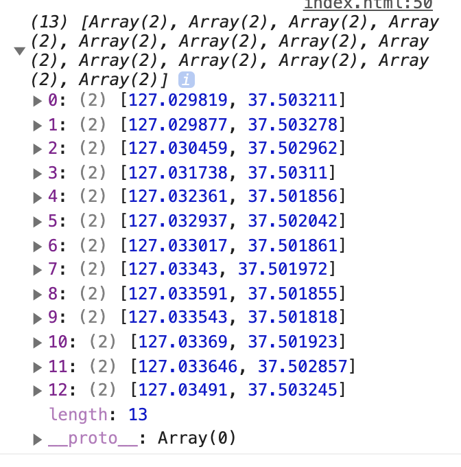

# Direction Example

```js
import MapboxService from "@dedong/mapbox-service";

const spotCoords = [
  [127.029835, 37.503202],
  [127.033547, 37.501815],
  [127.034931, 37.503215]
];

const mapboxService = new MapboxService({
  accessToken: "...token"
});

mapboxService.direction.getDirections({
  spotCoords,
  type: 'cycling'
}).then(coordinates => {
  console.log(coordinates);
});
```


