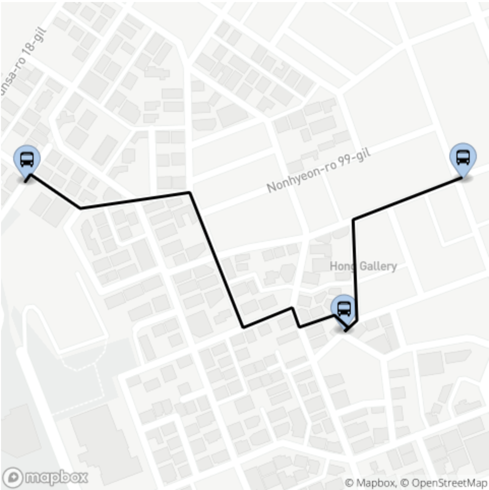

# Static Image Example

```js
import MapBoxService from "@dedong/mapbox-service";

const img = document.getElementById("img");
const spotCoords = [
  [127.029835, 37.503202],
  [127.033547, 37.501815],
  [127.034931, 37.503215]
];

const mapboxService = new MapBoxService({
  accessToken: "...token"
});

mapboxService.staticImage.getStaticImageSource({
  spotCoords,
  spotImageUrls: ["", "", ""],
  width: 480,
  height: 480,
  line: {
    color: "#000000",
    width: 3,
  }
}).then(source => {
  img.src = source;
})
```


